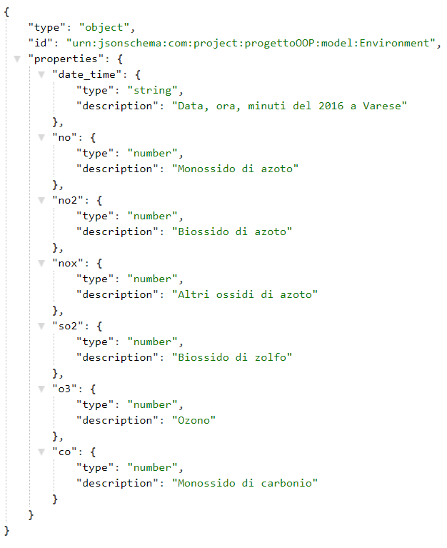
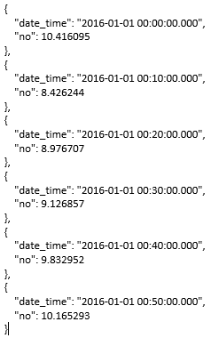
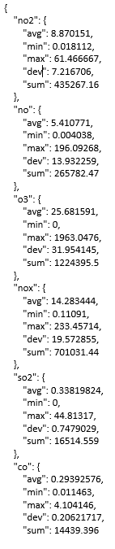
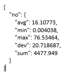
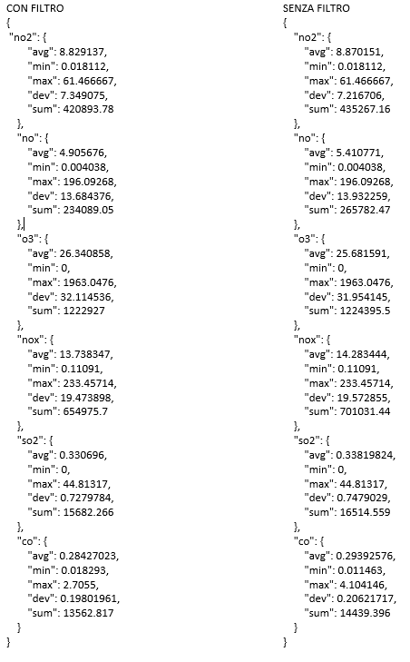
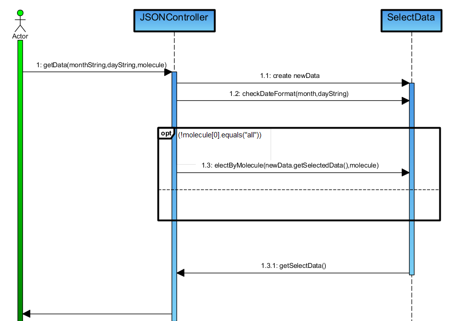
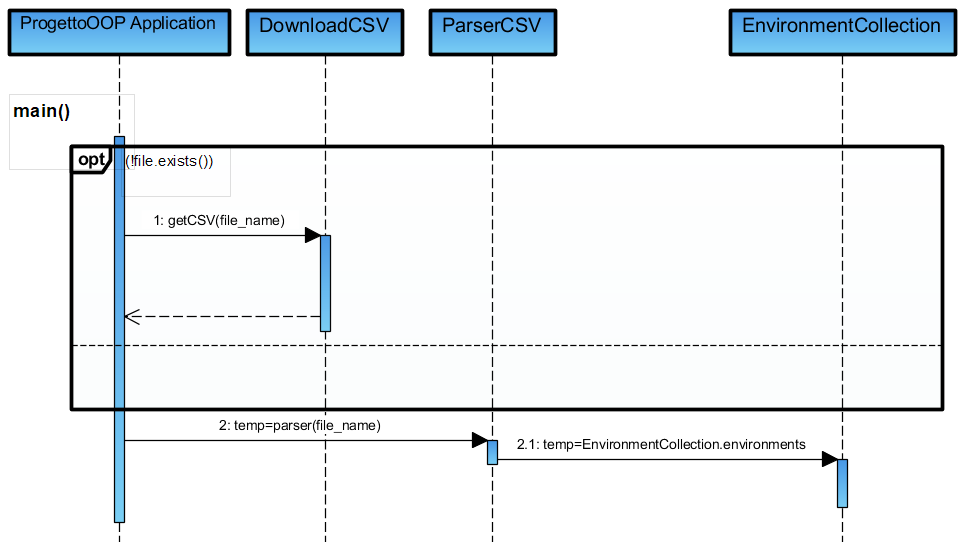

# ProgettoOOP
Progetto Esame Luglio 2019

L'applicazione presente nella repository  permette di ottenere dati a partire da un dataset contenuto in un file CSV, offrendo all'utente la possibilità di avere statistiche su essi,filtrarli nel modo voluto e soprattutto **fornire  statistiche su qusti ultimi**.

## Cosa rappresentano i dati

Sono dati provenienti  dal Osservatorio atmosferico CE situato in Ispra (Italia),che rappresentano la concentrazione di alcune molecole [ monossido di carbonio (CO), ozono (O3), biossido di zolfo (SO2), monossido di azoto (NO), biossido di azoto (NO2) e altri ossidi di azoto (NOx)] nell'atmosfera calcolati durante l'anno 2016 ogni 10 minuti di ogni giorno. **Ci siamo accorti che alcuni dati erano non coerenti  con gli altri, forse a causa di errori durante le misurazioni, quindi al fine di ottenere statistiche giuste abbiamo deciso di non tener conto di essi**.

## Come vengono restituiti i dati --->**ROTTE DELL'APPLICAZIONE**

Sono le varie vie che l'applicazione offre affinché svolga correttamente i task assegnati.
Vengono gestite nel nostro progetto dal JSONController e l'utente può fare 2 tipi di richieste: GET e POST. 
## GET 
I dati vengono restituiti, grazie al servizio , come un  **JSON** , in particolare un array di oggetti.

- L'utente può vedere da cosa è formato ogni oggetto chiedendo i metadati attraverso la rotta  **/metadata**.

 - Per la visualizzazione di tutti i dati viene utilizzata la rotta **/data**,ovviamente nella foto abbiamo riportato solo una piccolissima parte dei dati(in totale ci sono all'incirca 50.000). 
 
 - L'applicazione offre la rotta **/data?month=1,2,ecc&day=(1,2,ecc)&molecule=(no,no2,nox,so2,o3,co)  }** che permette di vedere solo dati relativi a determinati mesi,giorni o addirittura solo  molecole volute. Se nel  caso viene a mancare month,day o molecule l'applicazione considera che l'utente vuole vedere tutto.Nel esempio che segue abbiamo scelto la rotta **/data?month=1,2&molecule=no** che mostra i valori della molecola di **no** durante i mesi di gennaio e febbraio,ovviamente non abbiamo potutto rappresentarli tutti solo in parte:
 
 
 
 - **/statistics** rotta che permette di vedere le statistiche (media, minimo, massimo, dev. standard e somma) di ogni molecola su base annuale.
 
 
 
 -  **/statistics?{month=(1, 2, ecc)&day=(1, 2, ecc) &molecule=(no, no2, nox, so2, o3, co )**:permette di vedere una statistica su un determinati mesi,giorni o addirittura per molecola. Un esempio è la rotta **/statistics?month=1,2&day=1&molecule=no**:

La mancanza di una dei parametri fa si che l'applicazione considera che deve fare la statistica su tutti i dati del dato mancante
 -  **/statistics?day=3&month=2** restituisce le statistiche di tutte le molecole di 3 febbraio.
 -  **/statistics?month=2&molecule=so2** restituisce le statistiche della molecola so2 su tutto febbraio.
 -  **/statistics?day=2&molecule=so2** restituisce le statistiche della molecola so2 in base a valori del secondo giorno di tutti i mesi.
 
Come richiesto dalle specifiche del progetto abbiamo implementato le statistiche precedenti però **NON abbiamo  realizzato la statistica COUNT**, anche se richiesta, perché non erano presenti valori ripetuti interessanti.
 
## POST 
Le rotte utilizzate per le richieste **POST** sono: 
 - **/filter** :rotta che mi permette di fare i filtri su tutti i dati del dataset.
 - **/filter/statistics** permette di avere statistiche su dati filtrati. 
 
### Filtri
Come richiesto dalle specifiche del progetto abbiamo analizzato anche i filtri attraverso l'implementazione di :
 -  operatori logici **AND** e **OR** 
 - operatori condizionali  **between, greater e lower**

**NON abbiamo analizzato NOT , NIN, IN e EQUAL** a causa del tipo di dati contenuti nel Dataset, infatti non c'erano stringhe da confrontare (solo float).
La struttura del filtro è la seguente:
			

 - **{ < operatore logico > [{< filtro1 >},{< filtro2 >}, {< ecc >} }**
 
 Ogni **< filtro>** può avere altri operatori logici al suo interno, ognuno dei quali può a sua volta averne altri (vedere esempio)

**Esempi**:

- Filtro che prende solo gli elementi che hanno in comune contemporaneamente la  molecola di **no** ,con valore minore di 10.55, e quelle di **no2** ,maggiore di 16.25.

- Filtro che prende sia gli elementi che hanno la  molecola di **no** ,con valore compreso tra 10.4 e 10.55, sia quella di **no2**, tra 15.95 e 16.25 ,ovviamente presi una sola volta.

-  Filtro che prende sia gli elementi che hanno la  molecola di **no** ,con valore compreso tra 10.4 e 10.55, sia quella di **no2**, tra 15.95 e 16.25, sia quelli in cui la **data** è minore di quella indicata,ovviamente una sola volta.

- filtro che prende tutti gli elementi con  valori di **no** minori di 10.55 insieme a quelli che hanno contemporaneamente i valori di **no2** maggiori di 16.25 e quelli di **no**  maggiori di 10.

##  Statistiche su Filtri
L'applicazione offre anche la possibilità di calcolare le statistiche in base ai filtri chiesti dall'utente.
Effettuare una richiesta POST sulla  rotta **/filter/statistics** equivale a richiedere le statistiche su dati precedentemente filtrati;
si può osservare, in figura, che il risultato della rotta  **/statistics** è diverso da quello precedente.

##  UML
####  Class Diagram
Fornisce una vista strutturale del sistema.I blocchi rappresentano i Package e all'interno ci sono le classi che vi  appartengono,ognuna con i propri metodi e attributi.

####  Use Case Diagram
Spiega le funzioni che l'applicazione offre all'utente. 
 

####  Activity Diagram
Descrive le funzioni offerte dall'applicazione.  

####  Sequence Diagram
Utilizzato per descrivere un'azione,ovvero una determinata sequenza di eventi, che portano al risultato richiesto dall'utente.  
L'applicazione ha i seguenti diagrammi di sequenza  per quanto riguarda le funzioni utilizzate nel **JSONController**:

- **getMetadata**

- **getData** 

- **getStatistics()** 

- **getFilteredValues()** 

- **getStatisticsOfFilteredValues()** 

- **Download and Parsing**

 
